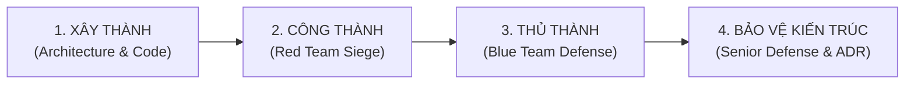

# ⚔️ ENTERPRISE BATTLEGROUND MASTER PLAN
## Lộ Trình Huấn Luyện Thực Chiến SRE & Cloud DevSecOps (2–3+ YoE)

> **Tuyên ngôn:** Kỹ sư SRE / Cloud DevSecOps thực thụ không được tạo ra từ những bài lab mẫu trong phòng thí nghiệm. Họ được tôi luyện qua những đợt nghẽn mạng lúc nửa đêm, những cuộc tấn công dồn dập vào cơ sở dữ liệu, và áp lực đưa hệ thống phục hồi với Zero Data Loss trong vòng vài phút.

---

## 🧭 TỔNG QUAN HAI GIAI ĐOẠN ĐÀO TẠO

```
[GIAI ĐOẠN 1: FOUNDATION BOOTCAMP (15 LABS)] ➔ [HOÀN THÀNH 100%]
├── Level 1: Core Networking & Linux (Labs 01-03)
├── Level 2: Production Infrastructure as Code - Terraform (Labs 04-06)
├── Level 3: Container & AWS EKS Kubernetes (Labs 07-09)
├── Level 4: DevSecOps CI/CD & GitOps ArgoCD (Labs 10-12)
└── Level 5: Observability & SRE Incident Response (Labs 13-15)

                      ⬇
[GIAI ĐOẠN 2: ENTERPRISE BATTLEGROUNDS (THỰC CHIẾN TÁC CHIẾN)] ➔ [KHỞI TRANH]
├── BATTLEGROUND 1: High-Throughput Fintech / E-Commerce Core
│   ├── Xây: Microservices + Kafka + Redis + PostgreSQL HA (Replication)
│   ├── Đánh: Flash Sale 10,000 RPS + Cache Avalanche + DB Master Kill
│   └── Thủ: KEDA Autoscaler + Circuit Breaker + Automated Failover
│
├── BATTLEGROUND 2: Zero-Trust & Runtime Security Hardening
│   ├── Xây: Kubernetes Cilium CNI (eBPF) + Vault Dynamic Secrets + Falco
│   ├── Đánh: Lateral Movement Hack + Pod Breakout + ServiceAccount Theft
│   └── Thủ: eBPF Network Isolation + Runtime Threat Interception + Auto-Kill
│
└── BATTLEGROUND 3: Multi-AZ Disaster Recovery & SRE Reliability Runbook
    ├── Xây: Multi-AZ Pod Topology Spread + Velero Snapshot Automation
    ├── Đánh: Simulate 1 AZ Outage + Data Corruption Disaster
    └── Thủ: Disaster Recovery Drill (RTO < 5 min, RPO = 0)
```

---

## 🥋 NGUYÊN TẮC HUẤN LUYỆN: 4 BƯỚC TÁC CHIẾN

Mỗi Chiến Trường (Battleground) được triển khai qua 4 bước khép kín chuẩn công nghiệp:



1. **Xây Thành (Build Phase):**
   - Lập tài liệu Kiến trúc & Quyết định Công nghệ (**ADR - Architecture Decision Record**).
   - Viết toàn bộ code triển khai dạng Infrastructure as Code (Terraform, Docker Compose, Kubernetes manifests, Helm).
   - Tối ưu hóa các thông số nhân hệ thống (sysctl, connection pooling, resource limits).
2. **Công Thành (Attack Phase - Red Team):**
   - Sử dụng các công cụ tải cao (`k6`, `vegeta`, `ab`) và chaos engineering script.
   - Bơm tải đột ngột, làm rò rỉ bộ nhớ, cắt đứt kết nối giữa các microservices, cố tình gây sập database hoặc chọc thủng lớp bảo mật.
   - Quan sát hệ thống sập để đo lường các giới hạn gãy đổ (*Breaking Points*).
3. **Thủ Thành (Defense Phase - Blue Team / SRE):**
   - Triển khai cơ chế phòng thủ chuyên sâu: **KEDA Autoscaling**, **Circuit Breaker Pattern**, **Cache Mutex Lock**, **Automated Failover**, **eBPF Security Policy**.
   - Chạy lại các bài tấn công để chứng minh hệ thống tự phục hồi hoặc giữ vững SLO cam kết.
4. **Bảo Vệ Kiến Trúc (Senior Architectural Defense):**
   - Viết báo cáo **Incident Defense & SRE Review**.
   - Thực hiện bài phỏng vấn phản biện với Mentor (Senior Interview Drill) trả lời các câu hỏi hóc búa về trade-offs, capacity planning và security posture.

---

## 📁 CẤU TRÚC LƯU TRỮ TRONG KHO MÃ NGUỒN

Tất cả các tài liệu, mã nguồn và báo cáo đều được lưu trữ trực tiếp trong thư mục `battlegrounds/`:

```
battlegrounds/
├── 01-high-throughput-ecommerce/
│   ├── 01-architecture-adr/            # Bản vẽ kiến trúc, Capacity Planning, ADR
│   ├── 02-infrastructure-deployment/   # Docker Compose / K8s manifests, Microservices code
│   ├── 03-chaos-siege-scripts/         # Scripts tấn công k6, fault injection, DB kill
│   ├── 04-sre-hardening-defense/       # Cấu hình KEDA, Circuit Breaker, Failover, Rate-limit
│   ├── 05-defense-post-mortem/         # Báo cáo phòng thủ & phỏng vấn kỹ thuật
│   └── README.md                       # Hướng dẫn chạy và tái hiện toàn bộ chiến trường
├── 02-zero-trust-runtime-security/
└── 03-multi-az-disaster-recovery/
```

---

## 🎯 BẢNG CHỈ SỐ ĐÁNH GIÁ NĂNG LỰC KỸ SƯ (2–3+ YOE)

| Kỹ Năng | Cấp Độ 0–1 YoE (Junior) | Cấp Độ 2–3+ YoE (Mục Tiêu Sau Giai Đoạn 2) |
| :--- | :--- | :--- |
| **Kiến trúc Hệ thống** | Chỉ biết kết nối ứng dụng với 1 database duy nhất | Thiết kế hệ thống phân tán chịu tải: Event-driven (Kafka), Caching nhiều lớp (Redis), Read/Write Database Split |
| **Xử lý Tải cao** | Chờ server sập rồi khởi động lại bằng tay | Autoscaling theo Queue Lag (KEDA), Rate Limiting đa tầng, Circuit Breaker chống sập lan chuyền |
| **Bảo mật Hạ tầng** | Chỉ dùng Security Group mở port | Zero-Trust với eBPF (Cilium), Dynamic Secret Rotation (Vault), Runtime Threat Prevention (Falco) |
| **Tính Sẵn Sàng (HA)** | Không có kế hoạch khi Data Center sập | Multi-AZ High Availability, Automated Database Failover < 30s, RTO < 5m, RPO = 0 |
| **Xử lý Sự cố (SRE)** | Hoảng loạn, đoán mò nguyên nhân | Đọc Grafana RED Method, phân tích Loki Log & Traces, lập lệnh Incident Commander bài bản |

---

## 🚀 TRẠNG THÁI HIỆN TẠI
- [x] Phê duyệt Kế hoạch Chiến trường (Master Plan)
- [ ] **BATTLEGROUND 1: High-Throughput E-Commerce Core** (ĐANG TRIỂN KHAI)
  - [ ] Hiệp 1: Thiết kế Bản vẽ Kiến trúc & ADR
  - [ ] Hiệp 2: Dựng cụm Hạ tầng Microservices + Kafka + Redis + Postgres Master/Replica
  - [ ] Hiệp 3: Bắn phá tải cực đại & Phá hủy hệ thống (Red Team Attack)
  - [ ] Hiệp 4: Kích hoạt lá chắn SRE (Autoscaler, Circuit Breaker, Failover)
  - [ ] Hiệp 5: Tổng kết Báo cáo & Phỏng vấn Bảo vệ Kiến trúc
- [ ] **BATTLEGROUND 2: Zero-Trust & Runtime Security Hardening**
- [ ] **BATTLEGROUND 3: Multi-AZ Disaster Recovery & SRE Reliability Runbook**
