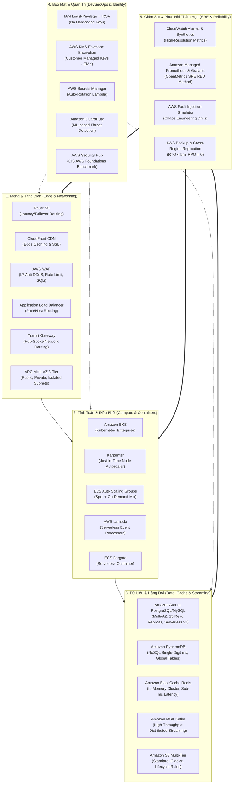

# 🏛️ ENTERPRISE CLOUD ARCHITECTURE & SRE DEFENSE BLUEPRINT
## Cẩm Nang Thiết Kế Hệ Thống Đám Mây Toàn Diện Cho Senior Cloud Infrastructure & DevSecOps / SRE

> **Mục tiêu tối thượng:** Cung cấp tư duy, bản vẽ thiết kế, bảng ánh xạ dịch vụ AWS và phương pháp luận giúp một kỹ sư có thể tự tin **thiết kế, tối ưu, bảo vệ và vận hành bất kỳ hệ thống nào trong MỌI HOÀN CẢNH**: từ một hệ thống **chắp vá, ngân sách thấp chạy trên VPS/Bare-metal** cho đến các **hạ tầng đám mây triệu đô (AWS Enterprise)**.

---

## 🧭 TRIẾT LÝ BÁC SĨ THỰC DỤNG: 3 CẤP ĐỘ HẠ TẦNG THỰC TẾ

Một kỹ sư giỏi không phải là người xúi công ty chi hàng nghìn đô mua dịch vụ AWS đắt đỏ khi họ không có tiền, mà là người **biết chẩn đoán, gia cố và bảo vệ hệ thống hiện có chạy ổn định với chi phí thấp nhất**, sau đó mới nâng cấp dần theo đà tăng trưởng doanh thu:

### 🥉 Cấp Độ 1: "Chiến Binh Nhà Nghèo" (Bootstrapped / Low-Budget / Chắp Vá)
- **Bối cảnh:** Startups, doanh nghiệp SMBs, ngân sách hạ tầng chỉ có **$20 - $100/tháng**.
- **Hạ tầng thực tế:** 1–2 con VPS giá rẻ (Hetzner, OVH, DigitalOcean, Linode) hoặc máy chủ vật lý đặt tại văn phòng. Toàn bộ dịch vụ chạy chung trong Docker Compose.
- **Vũ khí thực chiến của SRE/DevSecOps:**
  - **Tối ưu tài nguyên:** Tinh chỉnh Linux Kernel (`sysctl.conf`, TCP buffer, Swapiness, dirty_ratio), tối ưu RAM PostgreSQL (`shared_buffers = 25% RAM`, `work_mem = 4MB`).
  - **Khiên chắn bảo mật 0 đồng:** Tường lửa `UFW` + `iptables`, công cụ chống dò mật khẩu `Fail2ban` (chặn IP sau 5 lần thử), chặn DDoS/Bot qua **Cloudflare Free Tier** + NGINX Rate Limiting.
  - **Sao lưu tin cậy giá $1:** Cronjob dump Database ➔ nén mã hóa GPG ➔ đẩy tự động lên Cloud Storage giá rẻ (Backblaze B2 / Cloudflare R2 / S3).
  - **Giám sát SRE gọn nhẹ:** `Uptime Kuma` cảnh báo qua Telegram/Discord, `Netdata` hoặc `Prometheus + Grafana` tối giản tiêu tốn dưới 150MB RAM.

### 🥈 Cấp Độ 2: "Hệ Thống Đang Lớn / Chuyển Dịch" (Mid-Tier Scale / Hybrid)
- **Bối cảnh:** Doanh thu tăng trưởng, hệ thống nguyên khối (Monolith) bắt đầu quá tải, ngân sách **$300 - $2,000/tháng**.
- **Hạ tầng thực tế:**
  - Tách rời máy chủ Ứng dụng (Stateless) và máy chủ Dữ liệu (Stateful).
  - Sử dụng Load Balancer (HAProxy / AWS ALB) phân tải cho nhiều máy chủ App phía sau.
  - PostgreSQL Master - Standby Replica (tách luồng Đọc/Ghi).
  - Sử dụng Redis làm bộ nhớ đệm chống quá tải DB.
- **Nhiệm vụ của Kỹ sư:** Thực hiện quá trình chuyển dịch dữ liệu (Migration) không gián đoạn dịch vụ (**Zero-Downtime Migration**), thiết lập CI/CD tự động deploy và quy trình Rollback an toàn.

### 🥇 Cấp Độ 3: "Doanh Nghiệp Đám Mây Toàn Diện" (Enterprise Cloud Scale)
- **Bối cảnh:** Quy mô hàng triệu người dùng, yêu cầu bảo mật tài chính, ngân sách **$2,000 - $50,000+/tháng**.
- **Hạ tầng thực tế:** Hệ thống đa tài khoản AWS Landing Zone, Kubernetes EKS, Amazon Aurora Multi-AZ, Amazon MSK Kafka, AWS WAF, AWS KMS.
- **Nhiệm vụ của Kỹ sư:** Tuân thủ chuẩn bảo mật quốc tế (SOC2, ISO27001), tối ưu hóa chi phí (FinOps), diễn tập phục hồi thảm họa xuyên lục địa (**Multi-Region DR RTO < 5m**).

---

## 🧩 BẢNG ĐỐI CHIẾU NGUYÊN LÝ BẤT BIẾN (MỌI HOÀN CẢNH ĐỀU ÁP DỤNG ĐƯỢC)

| Bài Toán Kỹ Thuật | Giải Pháp VPS / On-Prem / Chắp Vá (Chi Phí Thấp) | Giải Pháp AWS Enterprise (Tập Đoàn Lớn) |
| :--- | :--- | :--- |
| **Phân Tải (Load Balancing)** | NGINX Reverse Proxy / HAProxy | AWS Application Load Balancer (ALB) |
| **Bảo Vệ L7 / Chống Bot** | Cloudflare Free / Pro + NGINX Limit Req | AWS WAF + CloudFront + AWS Shield |
| **Tường Lửa Mạng (Firewall)** | `UFW` + `iptables` / `nftables` | AWS Security Groups + NACLs + Network Firewall |
| **Chống Tấn Công Dò Quét** | `Fail2ban` (đọc log auth/nginx, tự chém IP) | Amazon GuardDuty + AWS WAF Rate-based Rules |
| **Bộ Nhớ Đệm (Cache)** | Redis tự dựng trên Docker (`redis.conf` tối ưu) | Amazon ElastiCache Redis Cluster Multi-AZ |
| **Hàng Đợi Xử Lý (Queue)** | RabbitMQ / Redis Streams / Kafka tự host | Amazon SQS FIFO / Amazon MSK (Managed Kafka) |
| **Cơ Sở Dữ Liệu Sẵn Sàng Cao**| Postgres Primary-Standby với WAL Streaming | Amazon Aurora PostgreSQL (Multi-AZ + Auto Failover) |
| **Sao Lưu & Phục Hồi** | Bash Script + pg_dump + Rclone lên Backblaze B2 | AWS Backup + S3 Cross-Region Replication |
| **Giám Sát Sự Cố (SRE)** | Uptime Kuma + Prometheus + Alertmanager | CloudWatch Synthetic Canaries + Managed Prometheus |

---

## PHẦN 1: 5 KHỐI XƯƠNG SỐNG DỊCH VỤ AWS (THE 5 CORE AWS PILLARS)

Một Senior Cloud Architect không học vẹt hơn 200 dịch vụ, mà nắm vững cách vận hành và ghép nối 5 khối trụ cột cốt lõi sau:



---

## PHẦN 2: 4 MẪU HÌNH KIẾN TRÚC DOANH NGHIỆP CHUẨN MỰC (REFERENCE ARCHETYPES)

Bất kỳ hệ thống nào trong ngành công nghệ phần mềm (từ Fintech, E-Commerce, SaaS B2B, đến Streaming) đều phát triển từ 1 trong 4 mẫu hình sau:

### MẪU HÌNH 1: HIGH-THROUGHPUT E-COMMERCE & FINTECH TRANSACTION ENGINE
*Mục tiêu: Chịu tải hàng chục ngàn giao dịch/giây, không nghẽn database, tuyệt đối không mất tiền/đơn hàng.*
- **Edge:** `Route 53` ➔ `CloudFront` + `AWS WAF` (Rate limit: 200 req/min/IP).
- **Network:** VPC Multi-AZ (3 AZs: `a`, `b`, `c`) gồm 3 tầng Subnet: Public (ALB/NAT), Private (EKS Pods), Isolated Data (Aurora, Redis).
- **Compute:** Amazon EKS tích hợp **Karpenter** (tự động gắn thêm Node c6i/m6i trong 40 giây khi traffic tăng vọt).
- **Event Bus & Buffering:** Amazon MSK (Kafka) đóng vai trò "Bộ giảm xóc" hấp thụ hàng chục ngàn đơn hàng/giây.
- **Data Tier:** 
  - `ElastiCache Redis Cluster`: Cache thông tin sản phẩm và dùng Atomic Counter trừ kho ảo tức thì ($< 1\text{ms}$).
  - `Amazon Aurora PostgreSQL Multi-AZ`: Tách biệt hoàn toàn Writer Instance và 2 Reader Instances.
- **SRE & Security:** KEDA autoscaling theo Kafka Lag, Circuit Breaker bảo vệ downstream, KMS mã hóa dữ liệu nhạy cảm.

---

### MẪU HÌNH 2: ENTERPRISE MULTI-ACCOUNT HUB-SPOKE LANDING ZONE
*Mục tiêu: Thiết kế mạng bảo mật cô lập cho các tập đoàn lớn có hàng trăm kỹ sư và nhiều môi trường.*
- **Quản trị Tài khoản:** `AWS Organizations` + `Control Tower` chia thành:
  - Account `Core-Network`: Quản lý Transit Gateway, Direct Connect, VPN.
  - Account `Security-Audit`: Nơi tập trung toàn bộ log CloudTrail, GuardDuty, Security Hub.
  - Account `Shared-Services`: Chứa CI/CD Runner, Artifacts Repo, GitOps Controller.
  - Account `Workloads-Prod` & `Workloads-Dev`: Chứa ứng dụng thực tế.
- **Mạng Trung Tâm (Hub-Spoke):** `AWS Transit Gateway (TGW)` kết nối tất cả VPC.
- **Zero-Trust Egress:** Toàn bộ traffic đi ra Internet từ các máy chủ Prod KHÔNG ĐƯỢC PHÉP đi trực tiếp, mà phải đi qua **Central Inspection VPC** có gắn `AWS Network Firewall` để quét mã độc và chặn rò rỉ dữ liệu.

---

### MẪU HÌNH 3: SERVERLESS & EVENT-DRIVEN REAL-TIME CORE
*Mục tiêu: Hệ thống thanh toán/xử lý sự kiện quy mô lớn với chi phí vận hành bằng 0 khi không có tải, tự mở rộng vô hạn.*
- **API Entry:** `Amazon API Gateway` (HTTP API) tích hợp AWS WAF và Cognito/Lambda Authorizer.
- **Xử lý Tính toán:** `AWS Lambda` (Node.js/Go/Python) khởi tạo với Graviton (tiết kiệm 20% chi phí).
- **Event Routing:** `Amazon EventBridge` định tuyến sự kiện giữa các domain nghiệp vụ.
- **Hàng đợi Tin cậy:** `Amazon SQS FIFO` + Dead-Letter Queue (DLQ) đảm bảo từng giao dịch tài chính chỉ được thực thi duy nhất 1 lần (Exactly-Once Processing).
- **Cơ sở dữ liệu:** `Amazon DynamoDB` với On-Demand Capacity và Global Tables (Replication qua nhiều AWS Region).

---

### MẪU HÌNH 4: ZERO-TRUST CONTAINER HARDENING & MULTI-REGION DISASTER RECOVERY
*Mục tiêu: Đạt chuẩn bảo mật khắt khe nhất (SOC2, PCI-DSS, ISO27001) và sống sót sau thảm họa sập cả một Data Center của AWS.*
- **Container Hardening:**
  - CNI: **Cilium eBPF** thay thế kube-proxy, thực thi L7 Network Policies (chặn mọi kết nối trái phép giữa các namespace).
  - Runtime Security: **Falco** cảnh báo và kích hoạt Lambda tự động hủy Pod nếu có hành vi mở terminal `/bin/sh` trái phép.
  - Cấp quyền: 100% qua IAM Roles for Service Accounts (IRSA), không bao giờ nhúng AWS Access Key vào container.
- **Disaster Recovery (Active-Passive / Warm Standby):**
  - Primary Region: `ap-southeast-1` (Singapore).
  - Secondary Region: `ap-southeast-2` (Sydney).
  - Aurora Global Database (Độ trễ replication xuyên lục địa $< 1$ giây).
  - `Route 53 Health Checks`: Tự động chuyển đổi DNS sang Secondary Region nếu Primary mất kết nối quá 60 giây (**RTO < 5 phút, RPO < 1 giây**).

---

## PHẦN 3: CÔNG THỨC SIZING & CAPACITY PLANNING CHUẨN SENIOR ARCHITECT

Là một kỹ sư cấp cao, mọi thông số phần cứng đều phải được tính toán chính xác bằng công thức toán học:

### 1. Tính toán Băng thông & Lưu lượng Mạng (Network Throughput Math)
$$\text{Network Bandwidth} = \text{RPS} \times \text{Average Payload Size (Bytes)} \times 8 \text{ (bits/Byte)}$$
- *Ví dụ:* 10,000 RPS với payload trung bình 5 KB:
  $$\text{Throughput} = 10,000 \times 5,000 \times 8 = 400,000,000 \text{ bps} \approx 400 \text{ Mbps}$$
  ➔ Loại EC2 Instance hoặc NAT Gateway phải có Network Performance $\ge 1 \text{ Gbps}$ (tránh dùng các dòng `t3.micro` chỉ có burst network giới hạn).

### 2. Tính toán Giới hạn Kết nối Cơ sở dữ liệu (Database Connection Pool Math)
$$\text{Max Connections PostgreSQL} = \frac{\text{RAM khả dụng (MB)} - \text{shared\_buffers}}{\text{work\_mem}} \text{ hoặc quy tắc kinh nghiệm: } (\text{CPU Cores} \times 2) + \text{Disk Spindle}$$
- Để phục vụ 10,000 người dùng đồng thời, **tuyệt đối không mở 10,000 connection vào DB**.
- Phải dùng Connection Pooler (PgBouncer hoặc AWS RDS Proxy) gom 10,000 kết nối từ client về còn **100 - 200 connection tái sử dụng liên tục** vào database.

### 3. Tính toán IOPS Ổ cứng (EBS gp3 / io2)
$$\text{Required IOPS} = \text{Write Transactions/s} \times \text{Pages Written per Transaction}$$
- Với đợt Flash Sale 2,000 write TPS, mỗi transaction ghi trung bình 3 dirty pages:
  $$\text{IOPS} = 2,000 \times 3 = 6,000 \text{ IOPS}$$
  ➔ Không thể dùng ổ cứng mặc định (3,000 IOPS của gp3), mà phải cấu hình provisioned IOPS lên $\ge 8,000 \text{ IOPS}$ để tránh hiện tượng Disk Queue Length nghẽn I/O.

---

## PHẦN 4: PHƯƠNG PHÁP LUẬN ĐÀO TẠO THỰC CHIẾN (DUAL-ROLE WORKFLOW)

Trong mọi bài thực hành, học viên sẽ liên tục luân chuyển giữa 2 chiếc mũ:

```
[MŨ 1: CLOUD & INFRASTRUCTURE ENGINEER]
  - Viết Infrastructure as Code (Terraform) chuẩn production, module hóa.
  - Phân tích chi phí (FinOps) và lựa chọn kích thước tối ưu.
  - Dựng hệ sinh thái hoàn chỉnh (Mạng, Tính toán, Dữ liệu, Cache, Queue).
                     ⬇
[MŨ 2: SRE & DEVSECOPS WARRIOR]
  - Đóng vai Red Team: Dùng k6, Chaos Mesh bắn phá cực hạn, làm rò rỉ bộ nhớ, cắt đứt kết nối.
  - Đóng vai Blue Team: Thiết lập Autoscaling, Circuit Breaker, WAF rate-limits, tự động chuyển đổi dự phòng (Auto-Failover).
  - Đóng vai Incident Commander: Phân tích log/metric, ra quyết định dập lửa trong < 5 phút và viết Blameless Post-Mortem.
```
