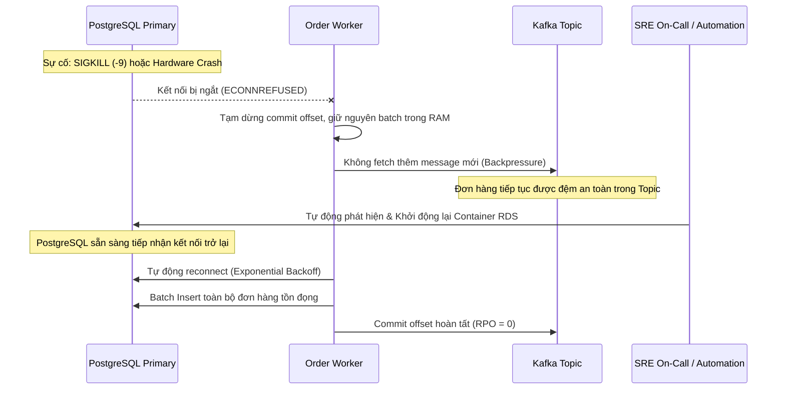

# 📘 SRE RUNBOOK: DATABASE DISASTER RECOVERY & AUTOMATED FAILOVER
## Battleground 01: High-Throughput E-Commerce & Fintech Core Engine

---

## 1. MỤC TIÊU SLO & CHỈ SỐ CAM KẾT (SERVICE LEVEL OBJECTIVES)

| Chỉ Số | Cam Kết (Target) | Cơ Chế Đạt Được |
| :--- | :--- | :--- |
| **RTO (Recovery Time Objective)** | `< 30 giây` | Docker container auto-restart / K8s liveness auto-healing. |
| **RPO (Recovery Point Objective)** | **0 đơn hàng thất thoát** | Kafka KRaft buffer bảo toàn toàn bộ đơn hàng trong hàng đợi khi DB offline. |
| **Worker Resilience** | Không rơi vào `CrashLoopBackOff` | Node.js `pg-pool` xử lý lỗi connection mềm và retry với Exponential Backoff. |

---

## 2. QUY TRÌNH PHẢN ỨNG SỰ CỐ (INCIDENT RESPONSE WORKFLOW)



---

## 3. LỆNH XỬ LÝ KHẨN CẤP (EMERGENCY RUNBOOK COMMANDS)

### 1. Kiểm tra sức khỏe kết nối DB từ Worker Pod:
```bash
kubectl --kubeconfig ~/.kube/floci-config -n ecommerce exec deployment/order-worker-deployment -- \
    node -e "const { pool } = require('./src/db'); pool.query('SELECT count(*) FROM orders').then(r => console.log('Total orders:', r.rows[0].count));"
```

### 2. Khởi động lại container RDS trên Floci nếu bị crash:
```bash
ssh root@13.140.183.90 "docker start floci-rds-cluster-CDB7CABC72DB40A386E0B3BC-4d06ed"
```

### 3. Kiểm tra số lượng connection dồn xuống DB:
```bash
kubectl --kubeconfig ~/.kube/floci-config -n ecommerce exec deployment/order-worker-deployment -- \
    node -e "const { pool } = require('./src/db'); pool.query('SELECT count(*) FROM pg_stat_activity WHERE state = \'active\'').then(r => console.log('Active DB Connections:', r.rows[0].count));"
```
