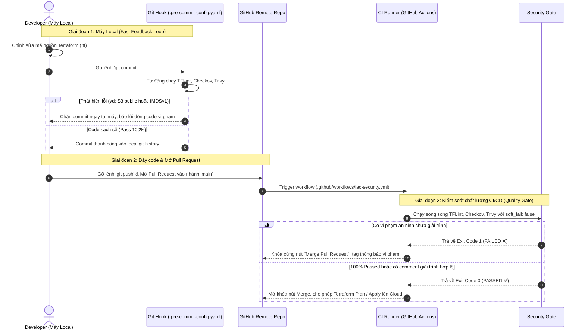

# 📚 BÀI HỌC KINH NGHIỆM: LEVEL 2 - LAB 06 (IaC SECURITY LINTERS & SHIFT-LEFT DEVSECOPS)

---

## 1. Dịch vụ & Khái niệm Cốt lõi (Core Concepts)

Trong kỷ nguyên Cloud Native và Infrastructure as Code (IaC), hạ tầng được định nghĩa bằng phần mềm (mã nguồn HCL). Do đó, an ninh hạ tầng không còn là việc "cài đặt firewall sau khi server đã chạy", mà phải được dịch chuyển toàn diện về phía trước (**Shift-Left Security**).

Bài lab này đào sâu bộ ba công cụ phân tích tĩnh (Static Analysis) tiêu chuẩn công nghiệp:
1. **Shift-Left DevSecOps & Policy-as-Code:** Nguyên lý kiểm soát bảo mật tự động hóa ngay từ IDE và Git commit/PR.
2. **TFLint & AWS Ruleset:** Linter kiểm tra cú pháp nâng cao, chuẩn hóa quy chuẩn đám mây AWS (Catalog Validation) và phát hiện Dead Code.
3. **Checkov (by Prisma Cloud / Bridgecrew):** Policy-as-Code scanner chuyên sâu dựa trên các bộ khung tuân thủ quốc tế (CIS AWS Foundations Benchmark, PCI-DSS, HIPAA, SOC 2).
4. **Trivy (by Aqua Security):** Comprehensive Security Scanner quét Misconfigurations, CVEs và Hardcoded Secrets.
5. **Kỹ thuật Suppression / Risk Acceptance:** Phương pháp miễn trừ rule có kiểm toán (Auditable In-code Skip Comments) trong dự án thực tế.

---

## 2. Định nghĩa Kỹ thuật Chuẩn (Formal Definition)

### A. Shift-Left Security trong IaC
- **Định nghĩa:** Là phương pháp tích hợp các bài kiểm tra bảo mật, tuân thủ (compliance) và chất lượng mã nguồn vào các giai đoạn sớm nhất của vòng đời phát triển phần mềm (SDLC) — ngay tại máy tính lập trình viên (pre-commit) hoặc trong Continuous Integration (CI PR build), trước khi lệnh `terraform apply` được cấp phép thực thi.
- **Mục tiêu:** Giảm thiểu tối đa "Mean Time to Detect" (MTTD) và triệt tiêu chi phí khắc phục lỗ hổng trước khi tài nguyên xuất hiện trên Cloud.

### B. TFLint & AWS Provider Plugin
- **Định nghĩa:** TFLint là một Pluggable Terraform Linter được viết bằng Go. Khác với `terraform validate` (chỉ kiểm tra ngữ pháp HCL cơ bản), TFLint tích hợp ruleset từ cloud providers (ví dụ `tflint-ruleset-aws`) để đối chiếu các giá trị cấu hình với catalog thực tế của nhà cung cấp (ví dụ: kiểm tra xem `instance_type` có tồn tại không, `availability_zone` có hợp lệ không, các attribute có bị deprecated không).

### C. Checkov & Policy-as-Code
- **Định nghĩa:** Checkov là công cụ phân tích tĩnh mã nguồn mở viết bằng Python chuyên đánh giá cấu hình IaC (Terraform, CloudFormation, Kubernetes, ARM, Bicep) dựa trên hơn 1000 chính sách an ninh được định nghĩa trước theo chuẩn **CIS Benchmarks** (Center for Internet Security).
- **Cơ chế:** Phân tích trừu tượng cây cú pháp (AST - Abstract Syntax Tree) của HCL để tìm các mẫu cấu hình sai (misconfigurations) mà không cần truy cập vào tài khoản cloud thật.

### D. Trivy (IaC & Secret Scanner)
- **Định nghĩa:** Scanner bảo mật đa năng từ Aqua Security hỗ trợ quét Container Images, File Systems, Git Repositories và IaC configurations. Trivy sử dụng cơ sở dữ liệu lỗ hổng AVD (Aqua Vulnerability Database) phân loại rõ ràng theo mức độ nghiêm trọng (CRITICAL, HIGH, MEDIUM, LOW).

---

## 3. Giải thích Dễ hiểu & Ẩn dụ Thực tế (Metaphors)

| Khái niệm | Ẩn dụ Đời sống | Ý nghĩa trong Cloud / DevOps |
| :--- | :--- | :--- |
| **Shift-Right (Truyền thống)** | Xây xong cả tòa nhà chọc trời rồi mới mời cảnh sát PCCC đến nghiệm thu. Phát hiện thiếu lối thoát hiểm thì phải đập tường xây lại. | Đợi deploy EC2, S3, RDS lên AWS rồi mới để AWS Security Hub / GuardDuty quét. Phát hiện lỗi thì hệ thống đã online và đối mặt nguy cơ bị hack. |
| **Shift-Left (Hiện đại)** | Kiến trúc sư trưởng và chuyên gia PCCC duyệt bản vẽ chi tiết trên giấy (AutoCAD) trước khi đổ móng. | Quét mã HCL bằng Checkov/Trivy ngay trên máy local hoặc Pull Request. Nếu không đạt chuẩn bảo mật thì cấm merge và cấm deploy. |
| **`terraform validate`** | Người chấm bài kiểm tra chính tả (đúng ngữ pháp tiếng Anh, đủ dấu chấm phẩy). | Chỉ kiểm tra file HCL có đúng cú pháp khai báo Terraform hay không, hoàn toàn mù tịt về logic cloud. |
| **TFLint** | Giám thị kiểm tra tính hợp lệ của số CMND và mã bưu chính trên hồ sơ. | Biết rõ `t2.microooo` là loại máy chủ giả mạo không có trên đời, biết biến nào khai báo mà không xài. |
| **Checkov & Trivy** | Ban thanh tra an toàn vệ sinh thực phẩm và phòng cháy chữa cháy quốc tế (ISO, CIS). | Bắt buộc bình chữa cháy phải có chốt an toàn (S3 phải SSE-AES256, EC2 phải khóa IMDSv2, SG cấm mở 0.0.0.0/0). |

---

## 4. Cách Dùng Thực Tế trong Môi Trường Production

### 1. Cấu Trúc Repository Chuẩn Doanh Nghiệp (Enterprise IaC Repo Structure)
Để đảm bảo toàn bộ kỹ sư và hệ thống tự động đều dùng chung **MỘT bộ quy chuẩn duy nhất (Single Source of Truth)**, cấu trúc repository được chuẩn hóa như sau:

```text
cloud-infrastructure/                       <-- Thư mục gốc của Git Repository
│
├── .github/workflows/                      <-- [CI/CD QUALITY GATE]
│   └── iac-security.yml                    <-- Pipeline chạy tự động khi mở Pull Request
│
├── .pre-commit-config.yaml                 <-- [LOCAL HOOK] Chặn lỗi ngay khi gõ 'git commit'
│
├── .tflint.hcl                             <-- [CẤU HÌNH TFLINT] Ruleset và AWS provider catalog
├── .checkov.yaml                           <-- [CẤU HÌNH CHECKOV] Framework, directory, soft-fail
├── .trivyignore                            <-- [CẤU HÌNH TRIVY] Danh sách ngoại lệ (Risk Acceptance)
│
└── labs/ hoặc environments/                <-- MÃ NGUỒN TERRAFORM (HCL)
    ├── dev/
    └── prod/
```

---

### 2. Chi Tiết Trọn Bộ 5 File Cấu Hình & Cơ Chế Hoạt Động

#### A. File [.tflint.hcl](file:///home/stark/Documents/Cloud/labs/level2-iac-terraform/lab06-security-linters/.tflint.hcl) (Cấu hình TFLint)
- **Nhiệm vụ:** Định nghĩa phiên bản ruleset của AWS Provider, bắt lỗi cú pháp nâng cao và biến rác (dead code).
```hcl
plugin "aws" {
  enabled = true
  version = "0.38.0"
  source  = "github.com/terraform-linters/tflint-ruleset-aws"
}

rule "terraform_required_version"     { enabled = true }
rule "terraform_required_providers"   { enabled = true }
rule "terraform_naming_convention"    { enabled = true }
rule "terraform_unused_declarations"  { enabled = true }
```

#### B. File [.checkov.yaml](file:///home/stark/Documents/Cloud/labs/level2-iac-terraform/lab06-security-linters/.checkov.yaml) (Cấu hình Checkov)
- **Nhiệm vụ:** Thiết lập tham số mặc định cho Checkov, đảm bảo không cần gõ flag dài dòng trên CLI.
```yaml
framework:
  - terraform
compact: true
quiet: false
soft-fail: false  # CỰC KỲ QUAN TRỌNG: Trả về exit code khác 0 khi có lỗi để chặn CI/CD
directory:
  - .
```

#### C. File [.trivyignore](file:///home/stark/Documents/Cloud/labs/level2-iac-terraform/lab06-security-linters/.trivyignore) (Miễn trừ rủi ro Trivy)
- **Nhiệm vụ:** Lưu trữ các mã vi phạm được doanh nghiệp chấp nhận rủi ro có kiểm toán rõ ràng.
```text
# Cho phép Egress HTTPS (port 443) ra Internet để cập nhật bản vá OS
AVD-AWS-0104

# Cho phép dùng SSE-S3 AES256 cho Data Lake Dev để tối ưu chi phí FinOps
AVD-AWS-0132
```

#### D. File [.pre-commit-config.yaml](file:///home/stark/Documents/Cloud/labs/level2-iac-terraform/lab06-security-linters/.pre-commit-config.yaml) (Tự động hóa ở Local)
- **Nhiệm vụ:** Kích hoạt hook chạy ngầm tại máy tính lập trình viên mỗi khi thực hiện `git commit`.
```yaml
repos:
  - repo: https://github.com/antonbabenko/pre-commit-terraform
    rev: v1.88.0
    hooks:
      - id: terraform_fmt
      - id: terraform_tflint
        args:
          - --args=--config=__GIT_WORKING_DIR__/.tflint.hcl
      - id: terraform_checkov
        args:
          - --args=--compact
          - --args=--config-file=__GIT_WORKING_DIR__/.checkov.yaml
      - id: terraform_trivy
        args:
          - --args=--severity=CRITICAL,HIGH
          - --args=--ignorefile=__GIT_WORKING_DIR__/.trivyignore
```

#### E. File [.github/workflows/iac-security.yml](file:///home/stark/Documents/Cloud/.github/workflows/iac-security.yml) (Cổng bảo mật CI/CD)
- **Nhiệm vụ:** Chốt chặn không thể vượt qua tại Pull Request. Nếu có vi phạm, pipeline báo đỏ và khóa nút Merge.
```yaml
name: "IaC DevSecOps Security Gate"

on:
  pull_request:
    branches: [ "main" ]

jobs:
  iac-security-gate:
    runs-on: ubuntu-latest
    steps:
      - name: Checkout Source Code
        uses: actions/checkout@v4

      - name: Setup Terraform & Check Formatting
        uses: hashicorp/setup-terraform@v3
      - run: terraform fmt -check -recursive

      - name: Setup & Run TFLint
        uses: terraform-linters/setup-tflint@v4
      - run: |
          tflint --init --config=.tflint.hcl
          tflint --config=.tflint.hcl --recursive

      - name: Run Checkov Security Scan
        uses: bridgecrewio/checkov-action@master
        with:
          config_file: .checkov.yaml
          soft_fail: false

      - name: Run Trivy Vulnerability Scan
        uses: aquasecurity/trivy-action@master
        with:
          scan-type: 'config'
          exit-code: '1'
          severity: 'CRITICAL,HIGH'
```

---

### 3. Vòng Đời Thực Thi: Local vs CI/CD (Execution Lifecycle)



---

### 4. Kỹ thuật Quản lý Ngoại lệ (Suppression / Exception Management)
Không có hệ thống nào áp dụng 100% mọi rule một cách máy móc. Ví dụ:
- Một Bastion Host bắt buộc phải mở Ingress SSH từ dải IP VPN công ty.
- Một môi trường Dev/Staging không cần bật Cross-Region Replication của S3 vì sẽ nhân đôi chi phí lưu trữ (FinOps).
- Một Public Web Server cần mở cổng 80/443 ra `0.0.0.0/0`.

**Nguyên tắc vàng:** Khi bỏ qua một rule an ninh, **bắt buộc phải ghi rõ lý do nghiệp vụ** trực tiếp trong mã để phục vụ kiểm toán (Auditing):
```hcl
resource "aws_s3_bucket" "data_lake" {
  # checkov:skip=CKV_AWS_144:Môi trường Dev không cần Cross-Region Replication để tối ưu chi phí
  # checkov:skip=CKV_AWS_145:Sử dụng SSE-S3 AES256 mặc định thay vì KMS CMK để giảm chi phí API requests
  bucket = "company-data-lake-dev"
}
```

Với Trivy, quản lý thông qua file `.trivyignore`:
```text
# Bỏ qua yêu cầu Customer Managed Key cho môi trường Dev
AVD-AWS-0132
# Cho phép outbound HTTPS để cập nhật bản vá OS
AVD-AWS-0104
```

---

## 5. Bài Học Xương Máu & Điều Cần Lưu Ý (Hard-won Lessons)

### 📋 Danh Mục Chi Tiết 16 Lỗi An Ninh Cần Chú Ý (Top IaC Security Violations)

Dưới đây là 16 lỗi an ninh kinh điển mà Checkov và Trivy bóc trần trên hạ tầng IaC mẫu, được phân chia theo 3 nhóm tài nguyên cốt lõi:

#### 🌐 Nhóm 1: Mạng & Security Group (Perimeter Security)
| Mã Lỗi (Checkov / Trivy) | Mức Độ | Nguy Cơ Thực Tế | Cách Khắc Phục Chuẩn IaC |
| :--- | :---: | :--- | :--- |
| **`CKV_AWS_24`**<br>`AVD-AWS-0107` | **HIGH** | Mở cổng quản trị SSH (port 22) ra `0.0.0.0/0`. Hacker/Botnet trên Internet sẽ liên tục brute-force mật khẩu hoặc khai báo lỗ hổng OpenSSH. | Giới hạn CIDR nghiêm ngặt về dải mạng nội bộ hoặc IP cố định của VPN công ty (`cidr_blocks = [var.vpc_cidr]`). |
| **`CKV_AWS_382`**<br>`AVD-AWS-0104` | **CRITICAL** | Egress mở toang tất cả các cổng (`protocol = "-1"`, `0.0.0.0/0`). Nếu server bị nhiễm mã độc, hacker dễ dàng thiết lập Reverse Shell hoặc tải dữ liệu bị rò rỉ ra ngoài (Data Exfiltration). | Thu hẹp Egress về cổng cần thiết (vd: port 443 HTTPS) và có mô tả mục đích kiểm toán rõ ràng. |
| **`CKV_AWS_23`**<br>`AVD-AWS-0124` | **LOW** | Không có trường `description` trong các rule Ingress/Egress. Gây khó khăn cho việc kiểm toán tuân thủ (PCI-DSS / SOC 2) và vận hành khi xảy ra sự cố mạng. | Luôn khai báo `description = "..."` giải thích rõ mục đích của rule. |

#### 🖥️ Nhóm 2: Máy Chủ EC2 & Danh Tính IAM (Compute & Identity Security)
| Mã Lỗi (Checkov / Trivy) | Mức Độ | Nguy Cơ Thực Tế | Cách Khắc Phục Chuẩn IaC |
| :--- | :---: | :--- | :--- |
| **`CKV_AWS_79`**<br>`AVD-AWS-0028` | **HIGH** | Cho phép truy cập **IMDSv1** (Instance Metadata Service v1). Khi server dính lỗ hổng SSRF, hacker có thể đọc trực tiếp credentials của IAM Role (vụ rò rỉ Capital One). | Bắt buộc bật IMDSv2:<br>`metadata_options { http_tokens = "required"; http_put_response_hop_limit = 1 }` |
| **`CKV_AWS_8`**<br>`AVD-AWS-0131` | **HIGH** | Ổ cứng Root EBS không được mã hóa At-Rest (`encrypted = false`). Khi ổ đĩa bị tháo rời hoặc snapshot bị lộ, dữ liệu nhạy cảm dễ dàng bị đọc lén. | Khai báo trong block `root_block_device { encrypted = true }`. |
| **`CKV_AWS_88`**<br>`AVD-AWS-0053` | **HIGH** | Gán Public IP trực tiếp cho máy chủ backend nội bộ (`associate_public_ip_address = true`), làm tăng bề mặt tấn công từ bên ngoài. | Đặt `associate_public_ip_address = false`, chỉ cho phép máy chủ nằm ở Private Subnet giao tiếp qua NAT Gateway/ALB. |
| **`CKV2_AWS_41`** | **MEDIUM** | EC2 Instance không được gắn IAM Role/Instance Profile. Điều này thường dẫn tới hành vi xấu là lập trình viên hardcode AWS Access Key & Secret Key vào file cấu hình trên server. | Gán `iam_instance_profile = aws_iam_instance_profile.app_profile.name`. |
| **`CKV_AWS_126`** | **LOW** | Không bật giám sát chi tiết CloudWatch (Detailed Monitoring 1-minute metric). Khó phản ứng nhanh khi máy chủ bị tấn công DDoS hoặc tràn tải CPU. | Cấu hình `monitoring = true`. |
| **`CKV_AWS_135`** | **LOW** | Không bật tối ưu hóa băng thông riêng cho EBS (`ebs_optimized = true`), dẫn đến nghẽn cổ chai IOPS khi đọc ghi dữ liệu lớn. | Cấu hình `ebs_optimized = true`. |

#### 🪣 Nhóm 3: Lưu Trữ S3 Bucket (Storage Security & FinOps Optimization)
| Mã Lỗi (Checkov / Trivy) | Mức Độ | Nguy Cơ Thực Tế | Cách Khắc Phục Chuẩn IaC |
| :--- | :---: | :--- | :--- |
| **`CKV2_AWS_6`**<br>`AVD-AWS-0093` | **CRITICAL** | S3 Bucket thiếu khối **Public Access Block**. Bất kỳ ai cũng có thể cấu hình nhầm ACL hoặc Bucket Policy khiến toàn bộ dữ liệu bị lộ công khai ra Internet. | Bắt buộc tạo resource `aws_s3_bucket_public_access_block` với cả 4 chốt an toàn đặt là `true`. |
| **`CKV_AWS_19`** / **`CKV_AWS_145`**<br>`AVD-AWS-0132` | **HIGH** | S3 Bucket không bật mã hóa mặc định Server-Side Encryption (SSE-S3 AES256 hoặc SSE-KMS). | Tạo resource `aws_s3_bucket_server_side_encryption_configuration` chỉ định thuật toán `AES256` hoặc KMS Key. |
| **`CKV_AWS_21`**<br>`AVD-AWS-0090` | **HIGH** | Thiếu Versioning. Khi dữ liệu bị mã hóa bởi ransomware hoặc bị thao tác xóa nhầm, không thể khôi phục lại phiên bản trước đó. | Tạo resource `aws_s3_bucket_versioning` với `status = "Enabled"`. |
| **`CKV2_AWS_61`** & **`CKV_AWS_300`** | **MEDIUM** | Thiếu vòng đời dữ liệu (Lifecycle) và quên hủy các phần tải lên dang dở (**Incomplete Multipart Uploads**). Dữ liệu rác âm thầm tích tụ gây lãng phí chi phí khổng lồ. | Cấu hình `aws_s3_bucket_lifecycle_configuration` với block `abort_incomplete_multipart_upload { days_after_initiation = 7 }`. |
| **`CKV_AWS_144`** | **LOW** | Chưa bật Cross-Region Replication (CRR). | Bỏ qua có kiểm toán bằng comment `#checkov:skip=CKV_AWS_144:Môi trường Dev không cần CRR để tối ưu FinOps`. |
| **`CKV_AWS_18`** | **LOW** | Chưa cấu hình Access Logging trực tiếp trên bucket. | Bỏ qua có kiểm toán `#checkov:skip=CKV_AWS_18:Log truy cập đã được gom về centralized log bucket của công ty`. |
| **`CKV2_AWS_62`** | **LOW** | Chưa cấu hình S3 Event Notification. | Bỏ qua có kiểm toán `#checkov:skip=CKV2_AWS_62:Bucket dữ liệu tĩnh không cần event notification`. |

---

### 💀 Horror Story 1: Thảm họa SSRF Capital One & Lỗ hổng IMDSv1
- **Sự cố:** Năm 2019, một cựu kỹ sư AWS đã tấn công vào hệ thống của ngân hàng Capital One bằng lỗi Server-Side Request Forgery (SSRF) trên con WAF. Con WAF này gửi request nội bộ tới địa chỉ `http://169.254.169.254/latest/meta-data/iam/security-credentials/` (IMDSv1). Vì IMDSv1 không yêu cầu header hay token xác thực, hacker lập tức lấy trọn vẹn AWS Access Key & Secret Key của IAM Role gán cho server và tải về dữ liệu của 106 triệu khách hàng.
- **Biện pháp khắc phục vĩnh viễn bằng IaC:**
  Luôn luôn ép buộc **IMDSv2** trên toàn bộ EC2:
  ```hcl
  metadata_options {
    http_endpoint               = "enabled"
    http_tokens                 = "required" # IMDSv2 bắt buộc PUT request lấy token trước
    http_put_response_hop_limit = 1          # Ngăn chặn packet nhảy qua proxy/container
  }
  ```
  Checkov rule `CKV_AWS_79` và Trivy rule `AVD-AWS-0028` sinh ra chính là để ngăn chặn thảm họa này tái diễn!

### 💀 Horror Story 2: Mở Ingress `0.0.0.0/0` trên Database & SSH
- **Sự cố:** Rất nhiều dev trong lúc debug vội vàng đã thêm `cidr_blocks = ["0.0.0.0/0"]` vào port 5432 (Postgres) hoặc port 22 (SSH) để "kết nối từ nhà cho tiện". Chưa đầy 15 phút sau khi deploy, botnet trên Internet đã quét thấy IP và thực hiện brute-force mật khẩu hàng triệu lần mỗi phút, dẫn tới tê liệt CPU hoặc bị cài mã độc đào tiền ảo.
- **Quy tắc bất biến:**
  - Không bao giờ gán IP Public cho Database hoặc Internal App servers (`associate_public_ip_address = false`).
  - Cổng nhạy cảm (22, 3389, 5432, 3306, 6379) chỉ được phép trỏ tới CIDR mạng nội bộ (`10.0.0.0/16`) hoặc Security Group nguồn (SG-to-SG chaining).

### 💀 Horror Story 3: Chi phí "ngầm" khổng lồ từ S3 Multipart Upload dở dang (`CKV_AWS_300`)
- **Sự cố:** Một ứng dụng upload các file video/backup lớn lên S3 qua Multipart Upload. Khi mạng chập chờn, upload bị đứt đoạn giữa chừng. Các phần (parts) đã upload thành công vẫn nằm lơ lửng trong S3 bucket. Chúng **không hiển thị trong danh sách file**, nhưng AWS vẫn đều đặn tính phí lưu trữ gigabyte/terabyte hàng tháng! Sau 1 năm, hóa đơn S3 tăng vọt hàng ngàn USD mà không ai biết lý do.
- **Biện pháp khắc phục:**
  Luôn cấu hình `abort_incomplete_multipart_upload` trong Lifecycle Rule:
  ```hcl
  abort_incomplete_multipart_upload {
    days_after_initiation = 7 # Tự động dọn dẹp các part rác sau 7 ngày
  }
  ```

### 💡 Bảng Tổng Kết So Sánh Bộ Ba Công Cụ

| Tiêu chí | TFLint | Checkov | Trivy |
| :--- | :--- | :--- | :--- |
| **Trọng tâm chính** | Cú pháp nâng cao, chuẩn catalog AWS, phát hiện Dead Code | Tuân thủ tiêu chuẩn an ninh quốc tế (CIS, PCI-DSS, SOC 2) | Quét lỗ hổng cấu hình (Misconfig), CVEs, Secret Leakage |
| **Tốc độ thực thi** | Cực nhanh (< 1 giây, Go binary) | Toàn diện, sâu sắc (5-15 giây, Python AST) | Nhanh, linh hoạt (< 2 giây, Go binary) |
| **Vị trí lý tưởng** | Pre-commit hook, Editor IDE Extension | CI Pipeline (Pull Request Blocking Quality Gate) | Container Scanner & Local/CI Security Gate |
| **Mức độ phụ thuộc Cloud** | Không cần tài khoản Cloud thật | Không cần tài khoản Cloud thật | Không cần tài khoản Cloud thật |
