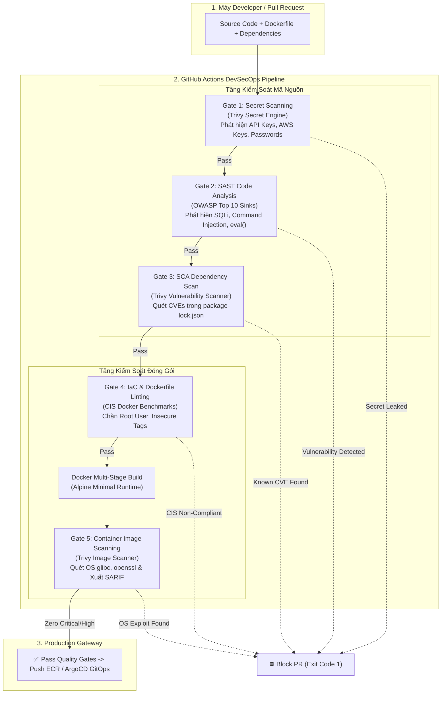

# 🥋 Lab 10: GitHub Actions Security (Enterprise DevSecOps CI/CD Pipeline)

> **Cấp độ:** Level 4: DevSecOps CI/CD Pipeline  
> **Mục tiêu:** Xây dựng quy trình tự động hóa kiểm soát an ninh đa tầng (**5-Stage Security Quality Gates**) tích hợp vào GitHub Actions theo triết lý **Shift-Left Security**. Khóa chặt 100% rủi ro bảo mật (Rò rỉ Secret, Mã độc injection, Lỗ hổng CVE thư viện, Dockerfile chạy quyền root) trước khi code được phép merge vào `main` và triển khai lên AWS EKS.

---

## 🏗️ 1. Kiến Trúc 5 Tầng Phòng Thủ (The 5 Security Gates)



---

## 🛡️ 2. Chi Tiết Bản Chất 5 Tầng Phòng Thủ (Senior DevSecOps Mindset)

### Gate 1: Secret Scanning (Quét Rò Rỉ Bí Mật)
* **Vấn đề thực tế:** Lập trình viên vô tình commit file `.env` hoặc paste cứng AWS Access Key (`AKIA...`), Stripe Key vào code để test nhanh rồi quên gỡ. Hacker dùng bot tự động quét commit GitHub chỉ mất **3 đến 5 phút** để lấy cắp key và đào tiền ảo làm phát sinh hóa đơn hàng chục nghìn USD.
* **Giải pháp:** Sử dụng Trivy Secret Scanner quét toàn bộ file tìm chuỗi entropy cao và regex patterns của các nhà cung cấp Cloud (AWS, GCP, Stripe, GitHub Tokens). Nếu phát hiện -> **Exit code 1, khóa PR ngay lập tức**.

### Gate 2: SAST (Static Application Security Testing - Quét Mã Nguồn Tĩnh)
* **Vấn đề thực tế:** Lập trình viên ghép chuỗi thô từ URL vào câu truy vấn database (`SELECT * FROM users WHERE id = '` + id + `'`) hoặc dùng lệnh hệ thống `child_process.exec(userInput)`.
* **Giải pháp:** Quét AST (Abstract Syntax Tree) và pattern matching tìm các "Dangerous Sinks" (nơi nhận input của người dùng đưa thẳng vào hàm thực thi nguy hiểm). Bắt buộc phải dùng Parameterized Queries và kích hoạt `helmet()` để có HTTP Security Headers.

### Gate 3: SCA (Software Composition Analysis - Quét Lỗ Hổng Thư Viện)
* **Vấn đề thực tế:** 80-90% mã nguồn ứng dụng hiện đại là mã của bên thứ 3 (Open Source qua npm, pip, maven). Kẻ tấn công khai thác lỗ hổng đã công bố (Known CVEs) trong thư viện cũ (như Log4Shell, Prototype Pollution trong `lodash 4.17.20`, RCE trong `jsonwebtoken 8.5.1`).
* **Giải pháp:** So chiếu mã băm và phiên bản trong `package-lock.json` với Cơ sở dữ liệu Lỗ hổng Quốc gia (NVD). Chặn đứng nếu thư viện dính cờ `CRITICAL` hoặc `HIGH`.

### Gate 4: IaC & Dockerfile Security Linting (Chuẩn CIS Docker Benchmarks)
* **Vấn đề thực tế:** Dockerfile mặc định không khai báo `USER`, container sẽ chạy dưới quyền **ROOT (UID 0)**. Khi ứng dụng bị tấn công RCE, hacker có ngay quyền root trên container và dễ dàng tìm cách bẻ gãy sandbox để leo thang đặc quyền ra máy chủ Host (Container Escape).
* **Giải pháp:** Kiểm tra các chỉ thị Dockerfile theo chuẩn CIS Benchmark: Bắt buộc khai báo `USER non-root`, cấm dùng tag `:latest`, phải có `HEALTHCHECK`, và không cài công cụ tấn công (`curl`, `netcat`, `telnet`).

### Gate 5: Container Image Vulnerability Scanning (Quét Hệ Điều Hành Container)
* **Vấn đề thực tế:** Code ứng dụng sạch sẽ, thư viện npm không lỗi, nhưng Image Base của hệ điều hành (Debian/Alpine) đi kèm các gói nhị phân cũ (`openssl`, `musl`, `glibc`, `zlib`) dính lỗ hổng tràn bộ đệm.
* **Giải pháp:** Quét toàn bộ layer nhị phân của container image. Nâng cấp bảo mật hệ điều hành (`apk upgrade --no-cache`), xóa bỏ các công cụ build rác (`npm`, `npx`) khỏi runner image để đạt chuẩn Zero High/Critical Vulnerabilities. Xuất báo cáo chuẩn **SARIF** tích hợp lên tab Security của GitHub.

---

## 🧪 3. Hướng Dẫn Thực Hành Diễn Tập (Hands-On Lab Walkthrough)

### Bước 1: Khảo Sát Cấu Trúc Mã Nguồn Mẫu
Thư mục [`sample-app/`](file:///home/stark/Documents/Cloud/labs/level4-devsecops-cicd/lab10-github-actions-security/sample-app):
* [`server.js`](file:///home/stark/Documents/Cloud/labs/level4-devsecops-cicd/lab10-github-actions-security/sample-app/server.js): API Express đã được tôi luyện bảo mật (Helmet, Input Whitelisting, Graceful Shutdown).
* [`server-vulnerable.js`](file:///home/stark/Documents/Cloud/labs/level4-devsecops-cicd/lab10-github-actions-security/sample-app/server-vulnerable.js): File chứa cứng AWS Secret Key, lỗi SQL Injection, Command Injection phục vụ sát hạch.
* [`Dockerfile`](file:///home/stark/Documents/Cloud/labs/level4-devsecops-cicd/lab10-github-actions-security/sample-app/Dockerfile): Chuẩn CIS Hardened, Multi-stage build, Non-root `node` user, Dumb-init PID 1.
* [`Dockerfile.insecure`](file:///home/stark/Documents/Cloud/labs/level4-devsecops-cicd/lab10-github-actions-security/sample-app/Dockerfile.insecure): Vi phạm CIS (chạy root, cài netcat/telnet, unpinned tag).

### Bước 2: Chạy Thử Từng Cổng An Ninh Bằng Script Mô Phỏng Local
Thay vì phải commit lên GitHub và chờ 5 phút, bạn có thể chạy ngay trên terminal của mình:

```bash
# Di chuyển vào thư mục lab10
cd /home/stark/Documents/Cloud/labs/level4-devsecops-cicd/lab10-github-actions-security

# 1. Kiểm tra Gate 1 (Secret Scanning) với chế độ mã sạch -> Kết quả: PASSED ✅
./scripts/run-pipeline-local.sh --gate=1 --mode=hardened

# 2. Thử nghiệm Gate 1 với chế độ mã dính Secret -> Kết quả: BLOCKED ❌ (Bắt quả tang Stripe Key)
./scripts/run-pipeline-local.sh --gate=1 --mode=insecure

# 3. Kiểm tra Gate 4 (Dockerfile CIS Benchmarks) với Dockerfile chuẩn -> PASSED ✅
./scripts/run-pipeline-local.sh --gate=4 --mode=hardened

# 4. Thử nghiệm Gate 4 với Dockerfile chạy quyền Root -> BLOCKED ❌ (Bắt lỗi CIS 4.1)
./scripts/run-pipeline-local.sh --gate=4 --mode=insecure
```

### Bước 3: Diễn Tập Toàn Diện Với Script Kịch Bản Sự Cố (Chaos Scenarios)
Chúng tôi đã chuẩn bị sẵn bộ diễn tập tương tác:
```bash
./scripts/test-scenarios.sh
```
Script sẽ lần lượt dẫn dắt bạn qua 4 tình huống sự cố thực tế và kết thúc bằng bản chạy Hardened Pass 100% toàn bộ 5 Gates.

### Bước 4: Kiểm Tra Workflow GitHub Actions
Xem cấu hình CI/CD hoàn chỉnh chuẩn Enterprise tại [`.github/workflows/devsecops-pipeline.yml`](file:///home/stark/Documents/Cloud/.github/workflows/devsecops-pipeline.yml):
* Cấu hình quyền tối thiểu (`permissions: contents: read, security-events: write`).
* Tự động xuất file báo cáo `trivy-results.sarif`.
* Tích hợp action `github/codeql-action/upload-sarif` để hiển thị cảnh báo trực tiếp trên giao diện Pull Request của GitHub.
