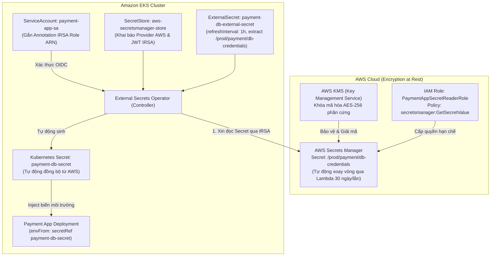

# 🥋 Lab 11: Enterprise Secrets Management & Automatic Rotation

> **Cấp độ:** Level 4: DevSecOps CI/CD Pipeline  
> **Mục tiêu:** Xây dựng hệ sinh thái quản lý bí mật an toàn chuẩn Zero-Trust cho Kubernetes và Cloud. Kết hợp **AWS Secrets Manager**, **AWS KMS**, **IAM Roles for Service Accounts (IRSA)** và **External Secrets Operator (ESO)** để loại bỏ hoàn toàn việc lưu trữ mật khẩu tĩnh trong mã nguồn và Kubernetes manifest.

---

## 🏗️ 1. Kiến Trúc Tổng Thể (The Zero-Trust Secrets Architecture)



---

## 📁 2. Cấu Trúc Các Thành Phần Đã Xây Dựng

```text
labs/level4-devsecops-cicd/lab11-secrets-management/
├── 00-insecure-k8s-secret/              # Mổ xẻ cạm bẫy Base64 của K8s Secret mặc định
├── 01-aws-secrets-manager/
│   └── payment-db-secret.json           # Cấu hình JSON Key-Value mẫu trên AWS Secrets Manager
├── 02-iam-irsa/
│   ├── 01-serviceaccount.yaml           # ServiceAccount gắn Annotation ARN của IAM Role
│   └── iam-policy-least-privilege.json  # IAM Policy chỉ cấp GetSecretValue trên đúng ARN
├── 03-external-secrets-operator/
│   ├── 01-secretstore.yaml              # Cấu hình kết nối AWS Provider sử dụng xác thực JWT IRSA
│   └── 02-externalsecret.yaml           # Quy tắc mapping dữ liệu & chu kỳ refreshInterval 1h
├── 04-app-deployment/
│   ├── 00-namespace.yaml                # Namespace payment cô lập an ninh (Blast Radius)
│   └── 01-deployment.yaml               # Deployment chuẩn CIS nạp secret qua envFrom
├── 05-rotation-simulation/
│   └── 01-unauthorized-pod-test.yaml    # Pod mô phỏng kẻ tấn công bị chặn đứng bởi IAM & RBAC
├── scripts/
│   └── simulate-secrets-workflow.sh     # 🚀 Script diễn tập toàn diện vòng đời Secret & Rotation
├── README.md                            # Hướng dẫn chi tiết
└── LESSONS-LEARNED.md                   # Kiến thức chuyên sâu Senior DevSecOps & Phỏng vấn
```

---

## 🧪 3. Hướng Dẫn Chạy Mô Phỏng & Diễn Tập

Di chuyển vào thư mục Lab 11 và thực thi script diễn tập:

```bash
cd /home/stark/Documents/Cloud/labs/level4-devsecops-cicd/lab11-secrets-management
./scripts/simulate-secrets-workflow.sh
```

### Script thực hiện 4 bước sát hạch thực tế:
1. **Auditing K8s Secret Base64:** Chứng minh chuỗi Base64 lộ mật khẩu trong 0.001s.
2. **Validating Manifests:** Kiểm tra cú pháp hợp lệ của toàn bộ file YAML Kubernetes và ESO.
3. **Simulating Automatic Secret Rotation:** Diễn tập quy trình đổi mật khẩu trên AWS qua Lambda và ESO tự động cập nhật vào K8s Secret mà không gây downtime.
4. **Simulating Attacker Pod Defense:** Chứng minh Pod không có quyền IRSA bị AWS từ chối với lỗi `AccessDeniedException`.
