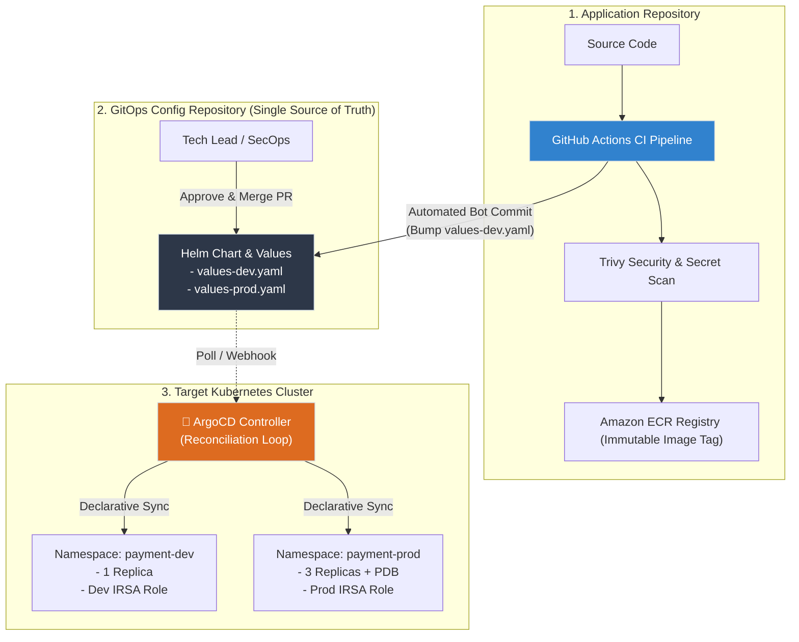

# Lab 12: Declarative Continuous Delivery with GitOps & ArgoCD

## 📌 Tổng quan đồ án (Lab Overview)

Lab 12 là mắt xích cuối cùng và cao cấp nhất trong chuỗi **Level 4: DevSecOps CI/CD Pipeline**. Đồ án này hiện thực hóa mô hình **GitOps (Pull-based Continuous Delivery)** chuẩn doanh nghiệp bằng cách kết hợp **Helm v3** (đóng gói ứng dụng) và **ArgoCD** (bộ điều khiển đồng bộ khai báo trạng thái trên Kubernetes).

---

## 🏗️ Kiến trúc tổng thể (Architecture Overview)

### Mô hình Push (Truyền thống) vs Mô hình Pull (GitOps Hiện đại)

```
[Mô hình Push Truyền thống - Rủi ro bảo mật]
Developer --> CI Runner (Chứa Kubeconfig Admin) ========> [K8s API Server] (Nguy cơ rò rỉ Kubeconfig)

[Mô hình Pull GitOps - Chuẩn Enterprise Zero-Trust]
Developer --> Git Repo (Source of Truth)
                  ^
                  | (HTTPS / Webhook Pull)
             [ArgoCD Controller] (Chạy nội bộ trong K8s) ===> [K8s API Server] (Không mở port ra ngoài)
```



---

## 📂 Cấu trúc thư mục đồ án (Project Structure)

```bash
lab12-gitops-argocd/
├── argocd-apps/                     # Khai báo ứng dụng Declarative ArgoCD
│   ├── 01-argocd-dev-app.yaml       # App Payment Vault môi trường Dev
│   └── 02-argocd-prod-app.yaml      # App Payment Vault môi trường Prod
├── helm-chart/                      # Helm Chart đóng gói microservice
│   ├── Chart.yaml                   # Metadata phiên bản Chart & AppVersion
│   ├── values.yaml                  # Hợp đồng giá trị mặc định (Contract baseline)
│   ├── values-dev.yaml              # Cấu hình tinh chỉnh môi trường Development
│   ├── values-prod.yaml             # Cấu hình High-Availability môi trường Production
│   └── templates/
│       ├── _helpers.tpl             # Chuẩn hóa Kubernetes Name & Labels
│       ├── deployment.yaml          # Deployment tuân thủ CIS Benchmark & Probes
│       ├── service.yaml             # ClusterIP Service nội bộ
│       ├── serviceaccount.yaml      # ServiceAccount tích hợp AWS IRSA Role
│       └── pdb.yaml                 # PodDisruptionBudget chống gián đoạn Prod
├── gitops-manifests/                # Thư mục lưu trữ artifact đồng bộ
├── scripts/                         # Bộ công cụ kiểm thử & mô phỏng
│   ├── ci-cd-handshake.sh           # Mô phỏng CI Bot cập nhật tag tự động
│   └── simulate-gitops-workflow.sh  # Digital Twin: Kiểm thử Sync, Drift & Rollback
├── README.md                        # Tài liệu hướng dẫn đồ án
└── LESSONS-LEARNED.md               # Kiến thức phỏng vấn & đúc kết kinh nghiệm
```

---

## 🚀 Các giai đoạn triển khai (Implementation Stages)

### Giai đoạn 1: Đóng gói Helm Chart chuẩn Doanh nghiệp
1. **Phân tách môi trường (Multi-Environment)**:
   * `values.yaml`: Khai báo bộ khung mặc định, cấm chạy root (`runAsNonRoot: true`), drop all capabilities (`drop: [ALL]`).
   * `values-dev.yaml`: Tối ưu tài nguyên cho dev (`1 replica`, CPU request: `50m`, RAM: `64Mi`).
   * `values-prod.yaml`: Đảm bảo tính khả dụng cao (`3 replicas`, CPU request: `200m`, RAM: `256Mi`, `PodDisruptionBudget` với `minAvailable: 2`).
2. **Bảo mật IRSA (IAM Roles for Service Accounts)**:
   * Tự động inject ARN Role từ Lab 11 vào Kubernetes ServiceAccount qua annotations.

### Giai đoạn 2: Khai báo ArgoCD Application (Declarative Delivery)
1. Sử dụng Custom Resource Definition `apiVersion: argoproj.io/v1alpha1`, `kind: Application`.
2. Bật tính năng tự phục hồi:
   ```yaml
   syncPolicy:
     automated:
       prune: true     # Tự xóa resource trên K8s nếu trong Git đã bị xóa
       selfHeal: true  # Tự động ghi đè nếu phát hiện cấu hình K8s bị sửa thủ công
   ```

### Giai đoạn 3: Cơ chế Bàn giao Tự động CI/CD (The Handshake)
* Trong mô hình GitOps, CI runner **không bao giờ deploy trực tiếp**.
* Sau khi test và build image an toàn với tag bất biến (ví dụ `1.2.3`), CI thực hiện **Git Commit** cập nhật file cấu hình Helm:
  ```bash
  # Tự động hóa cập nhật tag image trong file values
  sed -i -E 's/(tag: *")[^"]*(")/\11.2.3\2/' helm-chart/values-dev.yaml
  git commit -m "chore(ci): bump image tag to 1.2.3 [skip ci]"
  git push origin main
  ```

### Giai đoạn 4: Vận hành Thực tế (Drift Detection & Rollback)
* **Phát hiện và tự sửa lỗi (Drift & Self-Healing)**: Nếu kỹ sư lén gõ lệnh tay (`kubectl edit deployment`), ArgoCD sẽ phát hiện trạng thái thực tế lệch khỏi Git và tự động đồng bộ lại trong vài chục giây.
* **Declarative Rollback**: Khi phiên bản mới gặp sự cố, chỉ cần thực hiện `git revert` commit trên Git. ArgoCD tự động hạ phiên bản lỗi xuống và phục hồi phiên bản trước đó mà không cần bất kỳ can thiệp thủ công nào vào cluster.

---

## 🧪 Kiểm thử và Vận hành (Verification)

### 1. Kiểm tra cú pháp Helm Chart
```bash
helm lint helm-chart/ -f helm-chart/values-dev.yaml
helm lint helm-chart/ -f helm-chart/values-prod.yaml
```

### 2. Chạy kịch bản mô phỏng toàn diện (Digital Twin Simulation)
```bash
./scripts/simulate-gitops-workflow.sh
```
*Kịch bản sẽ tự động diễn tập 5 bước: Kiểm tra cú pháp -> Đồng bộ ban đầu -> Bàn giao CI/CD -> Tự phục hồi khi bị can thiệp tay -> Tự động Rollback bằng Git.*
