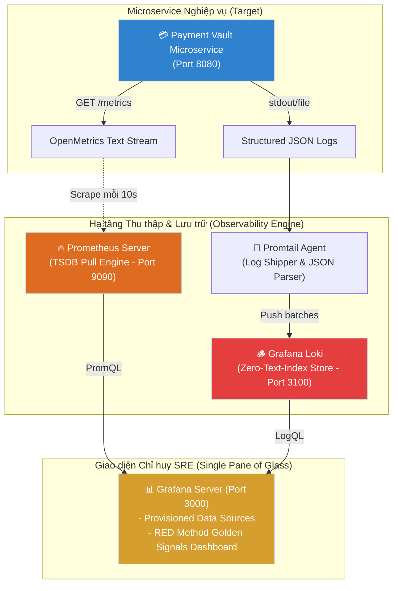

# Lab 13: Full-Stack Observability với Prometheus, Grafana & Loki

## 📌 Tổng quan đồ án (Lab Overview)

Lab 13 là đồ án mở đầu cho **Level 5: Observability & SRE (Xử lý sự cố)**. Đồ án xây dựng một hệ thống Giám sát & Quan sát toàn diện (Full-Stack Observability) cấp doanh nghiệp cho microservice thanh toán `payment-vault` bao gồm đầy đủ 2 trụ cột cốt lõi:
1. **Metrics**: Thu thập chỉ số phân tán với **Prometheus**, chuẩn hóa theo phương pháp **RED Method** của Google SRE.
2. **Logs**: Thu thập và truy vấn nhật ký tập trung siêu nhẹ với **Grafana Loki** & **Promtail** (tiết kiệm tới 80% RAM so với Elasticsearch).
3. **Trực quan hóa (Visualization)**: Xây dựng bảng điều khiển **Grafana** tự động nạp theo triết lý **Dashboard as Code**.

---

## 🏗️ Kiến trúc Hệ thống (Architecture Overview)



---

## 📂 Cấu trúc Thư mục Đồ án (Project Structure)

```bash
lab13-prometheus-grafana-loki/
├── 01-prometheus/
│   ├── prometheus.yml                 # Cấu hình Scrape Jobs định kỳ cho Prometheus
│   └── k8s-servicemonitor.yaml        # CRD ServiceMonitor triển khai trên AWS EKS
├── 02-loki-promtail/
│   ├── loki-config.yml                # Cấu hình Loki lưu trữ chunks nén, retention 7 ngày
│   └── promtail-config.yml            # Pipeline bóc tách JSON logs và gắn nhãn
├── 03-grafana/
│   ├── provisioning/
│   │   ├── datasources/
│   │   │   └── datasources.yml        # Tự động nạp Prometheus & Loki Data Sources
│   │   └── dashboards/
│   │       └── dashboards.yml         # Tự động quét thư mục nạp Dashboard JSON
│   └── dashboards/
│       └── payment-vault-red.json     # Dashboard thiết kế chuẩn RED Method Google SRE
├── 04-app-simulator/
│   ├── server.js                      # Microservice giả lập sinh Metrics & JSON Logs
│   └── Dockerfile                     # Container đóng gói Node.js runtime
├── docker-compose.yml                 # Điều phối cụm 5 container đồng bộ
├── README.md                          # Tài liệu hướng dẫn đồ án
└── LESSONS-LEARNED.md                 # Kiến thức chuyên sâu & Bộ câu hỏi phỏng vấn Senior SRE
```

---

## 📐 3 Tín hiệu Vàng: Phương pháp RED (Google SRE Standard)

Trên Dashboard Grafana, dịch vụ `payment-vault` được giám sát theo tiêu chuẩn **RED Method**:
1. **Rate (Tần suất)**: Số lượng request nhận được mỗi giây (RPS).
   * *PromQL:* `sum(rate(http_requests_total{app="payment-vault"}[1m]))`
2. **Errors (Tỷ lệ lỗi)**: Tỷ lệ phần trăm request bị lỗi HTTP 5xx trên tổng lưu lượng. Ngưỡng cảnh báo tự động chuyển sang màu đỏ khi vượt quá 5%.
   * *PromQL:* `(sum(rate(http_requests_total{status=~"5.."}[1m])) / sum(rate(http_requests_total[1m]))) * 100`
3. **Duration (Độ trễ/Thời gian phản hồi)**: Đo lường thời gian xử lý qua các phân vị P50 (Median), P95 (Tail Latency), P99 (Worst Case).
   * *PromQL:* `histogram_quantile(0.95, sum(rate(http_request_duration_seconds_bucket[1m])) by (le))`

---

## 🚀 Hướng dẫn Vận hành & Kiểm thử (Run & Verification)

### 1. Khởi động toàn bộ cụm Observability
```bash
cd labs/level5-observability-sre/lab13-prometheus-grafana-loki
docker compose up -d
```

### 2. Kiểm tra trạng thái các container
```bash
docker compose ps
```
*Đảm bảo cả 5 container: `grafana`, `loki`, `promtail`, `prometheus`, `payment-vault-app` đều ở trạng thái `Up`.*

### 3. Kiểm tra dữ liệu thô (Raw Endpoints)
* **Metrics OpenMetrics:** `curl -s http://localhost:8080/metrics | head -n 15`
* **Loki Readiness:** `curl -s http://localhost:3100/ready`
* **Prometheus Targets:** Truy cập `http://localhost:9090/targets` (xác nhận state `UP 1/1`).

### 4. Mở buồng lái Grafana SRE Cockpit
* **URL:** `http://localhost:3000` (User: `admin` | Password: `admin`)
* Điều hướng: **Dashboards** ➔ **Payment Services** ➔ **Payment Vault - SRE Golden Signals**.
* Quan sát biểu đồ RED method cập nhật thời gian thực không cần cấu hình bằng tay.

---

## 🔍 Thao luyện PromQL & LogQL trong mục Explore

1. **PromQL (Data Source: Prometheus):**
   * Tính số lỗi 500 phát sinh trong 5 phút qua:
     ```promql
     increase(http_requests_total{status="500"}[5m])
     ```
2. **LogQL (Data Source: Loki):**
   * Lọc riêng các log có chữ "ERROR":
     ```logql
     {app="payment-vault-service"} |= "ERROR"
     ```
   * Bóc tách JSON và lọc theo status 500:
     ```logql
     {app="payment-vault-service"} | json | status = 500
     ```
