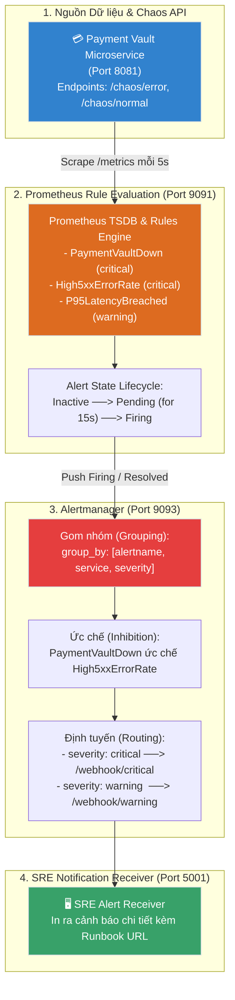

# Lab 14: Enterprise Alerting, SLO/SLI & Alertmanager

## 📌 Tổng quan đồ án (Lab Overview)

Lab 14 là đồ án thứ hai trong **Level 5: Observability & SRE (Xử lý sự cố)**. Đồ án giải quyết triệt để hội chứng kiệt sức vì cảnh báo rác (**Alert Fatigue**) trong doanh nghiệp bằng cách chuyển dịch từ giám sát ngưỡng tĩnh sang **Hệ thống Cảnh báo Hướng Cam kết Dịch vụ (SLO/SLI & Error Budget Alerting)** theo chuẩn Google SRE:
1. **Thiết kế Chỉ tiêu Dịch vụ (SLO/SLI)**: Xây dựng hợp đồng cam kết chất lượng với Availability $\ge 99.9\%$ và P95 Latency $\le 200\text{ms}$.
2. **Prometheus Alerting Rules**: Viết các quy tắc cảnh báo cấp cao kết hợp thời gian trễ (`for: 15s - 1m`) để triệt tiêu nhiễu và đợt tăng vọt chớp nhoáng (Spikes).
3. **Alertmanager Engine**: Khai báo các chiến lược **Grouping** (gom nhóm), **Inhibition** (ức chế cảnh báo thứ cấp), và **Routing** (phân luồng `critical` vs `warning`).
4. **Mock Alert Receiver & Chaos Simulator**: Tích hợp Webhook Receiver và API bơm lỗi giả lập để kiểm thử toàn diện chu kỳ sống của Alert.

---

## 🏗️ Kiến trúc Luồng Cảnh báo (Alerting Pipeline)



---

## 📂 Cấu trúc Thư mục Đồ án (Project Structure)

```bash
lab14-alerting-slo-sli/
├── 01-slo-sli-design/
│   └── payment-vault-slo.md           # Hợp đồng cam kết dịch vụ SLO/SLI & Error Budget
├── 02-prometheus-rules/
│   ├── payment-vault-alerts.yml       # Quy tắc cảnh báo Prometheus (có link Runbook)
│   └── k8s-prometheusrule.yaml        # CRD PrometheusRule cho AWS EKS
├── 03-alertmanager/
│   └── alertmanager.yml               # Cấu hình Grouping, Inhibition, và Routing Tree
├── 04-alert-receiver/
│   ├── server.js                      # Webhook receiver phân tích JSON payload
│   └── Dockerfile                     # Container receiver cổng 5001
├── 05-app-simulator/
│   ├── server.js                      # App thanh toán tích hợp Chaos Injection API
│   └── Dockerfile                     # Container ứng dụng cổng 8081
├── scripts/
│   └── chaos-trigger-alert.sh         # Kịch bản kiểm thử tự động toàn diện
├── prometheus.yml                     # Cấu hình Prometheus kết nối Alertmanager & Rules
├── docker-compose.yml                 # Điều phối toàn bộ cụm 4 container
├── README.md                          # Tài liệu hướng dẫn đồ án
└── LESSONS-LEARNED.md                 # Kiến thức chuyên sâu & Bộ câu hỏi phỏng vấn Senior SRE
```

---

## 🚀 Hướng dẫn Chạy Kiểm thử Tự động (Automated Chaos Drill)

Để chứng kiến toàn bộ chu trình phát hiện lỗi, nổ cảnh báo và tự động giải quyết:

```bash
cd labs/level5-observability-sre/lab14-alerting-slo-sli
bash scripts/chaos-trigger-alert.sh
```

### Các giai đoạn diễn tập tự động diễn ra:
1. **Kiểm tra Baseline**: Toàn bộ rules đang ở trạng thái `Inactive` (Xanh).
2. **Bơm sự cố**: Gọi `POST /chaos/error` đẩy tỷ lệ lỗi lên 60%.
3. **Lọc nhiễu (Pending)**: Prometheus phát hiện lỗi nhưng chờ trong 15s để loại trừ spike.
4. **Nổ cảnh báo (Firing)**: Hết thời gian chờ, Prometheus bắn alert sang Alertmanager.
5. **Gom nhóm & Định tuyến**: Alertmanager gom nhóm và đẩy sang Webhook Receiver in ra console.
6. **Dập tắt sự cố (Recovery)**: Gọi `POST /chaos/normal`, tỷ lệ lỗi về 0%, Alertmanager tự động gửi bản tin `[ALERT RESOLVED]`.

---

## 🔍 Kiểm tra Trực tiếp trên Trình duyệt

* **Prometheus Alerts UI:** `http://localhost:9091/alerts` (Theo dõi thanh trạng thái màu sắc).
* **Alertmanager UI:** `http://localhost:9093` (Xem danh sách các Alert đang gom nhóm và Silence rules).
* **Xem log cảnh báo:** `docker logs -f alert-receiver-lab14`.
